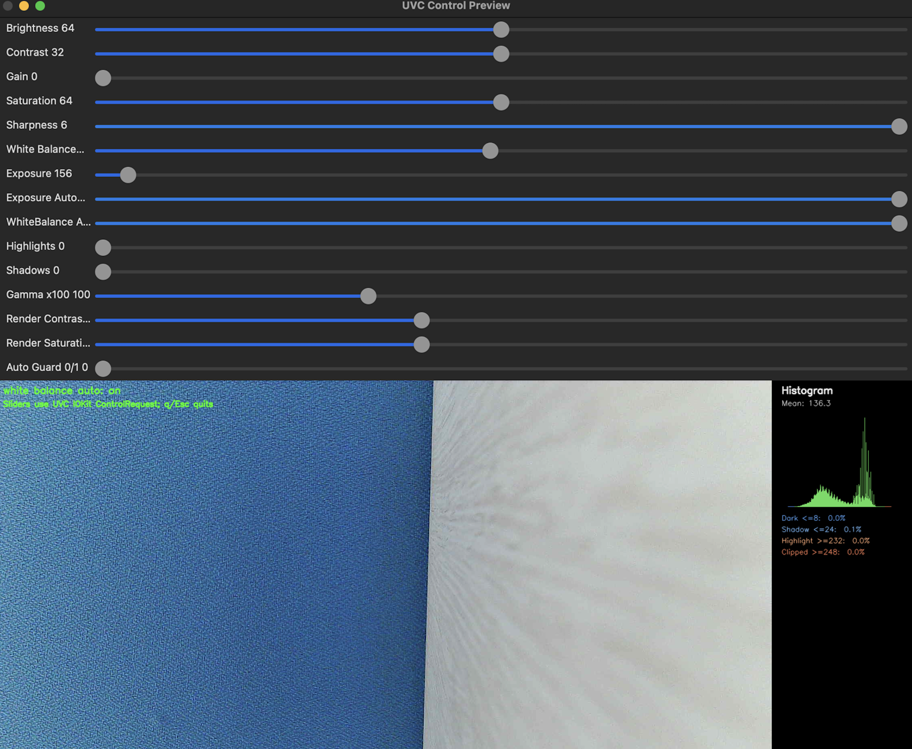

# MAC-UVC-Camera-Controller

A Python-based UVC camera control and preview tool for macOS using native IOKit USB control requests.

Unlike standard camera utilities that rely on OpenCV camera properties or vendor SDKs, this project communicates directly with UVC devices through macOS IOKit ControlRequest calls while providing a real-time preview interface.

## Features

- Real-time camera preview
- Hardware-level UVC control
- Brightness / Contrast / Gain adjustment
- Exposure control
- White balance control
- Histogram visualization
- Auto exposure guard
- Native IOKit backend

## Screenshot

## Requirements

- macOS
- Python 3.10+
- OpenCV
- NumPy
- Xcode Command Line Tools

## Installation

bash pip install opencv-python numpy 

## Usage

bash python main.py 

## Why This Project?

Most camera control tools either depend on vendor-specific software or use high-level APIs that do not expose the full UVC control interface.

This project demonstrates direct UVC communication through macOS IOKit while maintaining a lightweight Python-based workflow for image tuning and evaluation.

## License

MIT
